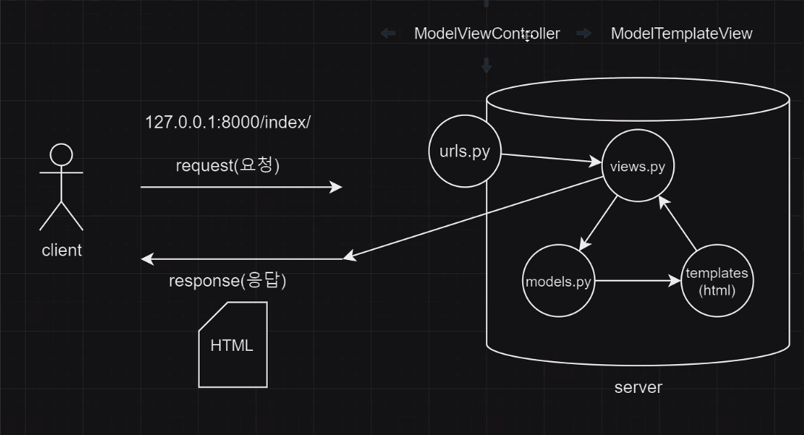

# django

1. 프로젝트 생성

```
django-admin startproject <pjtname> .  
```

2. 가상환경 설정
```
python -m venv venv
```

3. 가상환경 활성화/비활성화
- 원본 파이썬은 그대로 두고, 파이썬 버전을 복제해와서 이 파일에 저장해둔 것. 
- (이후 버전업데이트가 되더라도 웹사이트 구현에 오류가 없도록하기 위해?)
```
# 활성화
<!-- window -->
source venv/Scripts/activate
<!-- macOS -->
source venv/bin/activate

# 비활성화
deactivate
```

4. 가상환경 내부에 django 설치
```
pip install django
```
- 설치되었는지 확인하려면: `pip list`

5. 서버 실행 확인 (종료 `ctrl+c`)
```
python manage.py runserver
```

6. 앱 생성
```
django-admin startapp <appname>
```

7. 앱 등록
- `settings.py`의 `INSTALLED_APPS`에 등록
    `<appname>`을 등록


8. `urls.py`
```python
from django.urls import path
from app_intro import views

urlpatterns = [
    path('admin/', admin.site.urls),
    path('index/', views.index),
]
```

9. `views.py`
```python
def index(request):
    return render(request, 'index.html')
```

10. templates 폴더 생성 => index.html 생성

## MTV
- MTV: ModelTemplatesView 
  (MVC: ModelViewController와 같은 개념)

